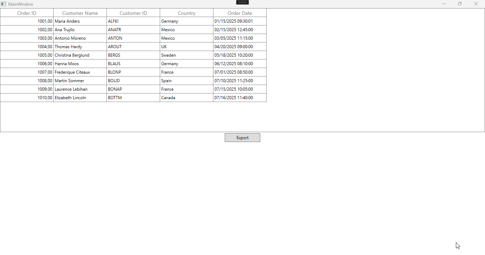

# How to display and export DateTimeColumn using exact separators regardless of system language in WPF DataGrid?

In [WPF DataGrid](https://www.syncfusion.com/wpf-controls/datagrid) (SfDataGrid), [DateTimeColumn](https://help.syncfusion.com/cr/wpf/Syncfusion.UI.Xaml.Grid.GridDateTimeColumn.html) will display custom formats differently depending on the system language, such as German vs English. This occurs because .NET adheres to the system’s culture settings, including date and time separators, even when a **custom format** pattern is defined. This behavior is by design.

To ensure consistent display of date and time separators across different system languages or regions, separator characters must be enclosed in single quotes (') within the format pattern.

```xml
<syncfusion:GridDateTimeColumn MappingName="OrderDate" HeaderText="Order Date" Pattern="CustomPattern" CustomPattern="MM'/'dd'/'yyyy HH':'mm':'ss" />
```

The custom pattern of GridDateTimeColumn is applicable only for the SfDataGrid, and not automatically applied during Excel export. To applying a proper date time format during export can be achieved using [CellsExportingEventHandler](https://help.syncfusion.com/cr/wpf/Syncfusion.UI.Xaml.Grid.Converter.ExcelExportingOptions.html#Syncfusion_UI_Xaml_Grid_Converter_ExcelExportingOptions_CellsExportingEventHandler) of [ExcelExportingOptions](https://help.syncfusion.com/cr/wpf/Syncfusion.UI.Xaml.Grid.Converter.ExcelExportingOptions.html).

```csharp
 private void OnExcelExporting(object sender, RoutedEventArgs e)
 {           
     var options = new ExcelExportingOptions();          
     options.CellsExportingEventHandler = CellExportingHandler;
     options.ExcelVersion = ExcelVersion.Excel2016;
     options.ExportAllPages = true;
     var excelEngine = dataGrid.ExportToExcel(dataGrid.View, options);
     var workBook = excelEngine.Excel.Workbooks[0];
     workBook.SaveAs("Export.xlsx");
     Process.Start(new ProcessStartInfo{ FileName = "Export.xlsx"});
 }


 private static void CellExportingHandler(object sender, GridCellExcelExportingEventArgs e)
 {
     if (e.CellType == ExportCellType.RecordCell && e.ColumnName == "OrderDate")
     {               
         if (DateTime.TryParse(e.CellValue.ToString(), out DateTime orderDate)) 
             // To set the formmatting with culture specific
             e.Range.Cells[0].Value = orderDate.ToString("MM/dd/yyyy HH:mm:ss",CultureInfo.InvariantCulture);
         else
             e.Range.Cells[0].Value = e.CellValue.ToString();
         
         e.Handled = true;
     } 
 }
```


Take a moment to peruse the [WPF DataGrid - GridDateTimeColumn](https://help.syncfusion.com/wpf/datagrid/column-types#griddatetimecolumn) documentation, where you can find about datetime column with code examples.
